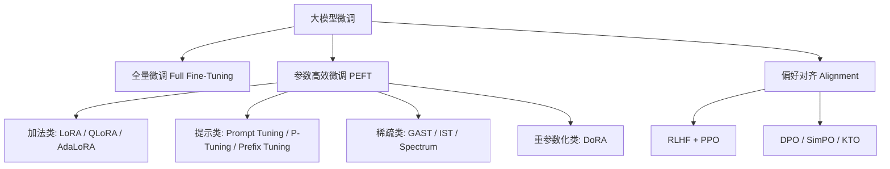

# 大模型微调技术全景指南

> 本文系统整理了当前主流及前沿的大语言模型微调技术，涵盖基础概念、经典方法、最新进展（2025–2026）及实践指南。

---

## 目录

1. [概述与分类框架](#1-概述与分类框架)
2. [全量微调](#2-全量微调)
3. [参数高效微调](#3-参数高效微调-peft)
4. [偏好对齐技术](#4-偏好对齐技术)
5. [2025–2026 前沿进展](#5-2025–2026-前沿进展)
6. [灾难性遗忘与稳定性控制](#6-灾难性遗忘与稳定性控制)
7. [工具链与框架](#7-工具链与框架)
8. [硬件选择与实践指南](#8-硬件选择与实践指南)
9. [方法对比速查表](#9-方法对比速查表)
10. [参考文献](#10-参考文献)

---

## 1. 概述与分类框架

大模型微调（Fine-Tuning）是指在预训练大语言模型的基础上，使用特定领域或任务的数据进行继续训练，使模型适配下游任务的过程。按照参数更新规模和训练范式，可划分为以下大类：



**技术选型决策路径**：提示工程 → RAG（检索增强生成） → 微调 → 全量微调，逐步升级。

---

## 2. 全量微调

### 2.1 原理

更新预训练模型的所有参数，使模型最大程度适配目标领域。是效果上限最高的方法，但计算和存储成本也最高。

### 2.2 关键参数

| 参数 | 典型值 |
|------|--------|
| 更新参数量 | 100%（如 7B 模型更新 70 亿参数） |
| 显存需求 | ~48GB（以 DeepSeek-7B 为例） |
| 学习率 | 1e-5 ~ 5e-5 |
| Batch Size | 64 ~ 256（序列级） |
| Epoch | 1 ~ 5 |

### 2.3 适用场景

- 数据量大（万级+）、计算资源充足
- 对精度要求极高的垂直领域（医疗、法律、金融）
- 与预训练数据分布差异大的特定领域

### 2.4 优缺点

| 优点 | 缺点 |
|------|------|
| 效果理论上最佳 | 显存和算力消耗极高 |
| 适配自由度最大 | 容易过拟合、灾难性遗忘 |
| 无需额外设计 | 每个任务需保存完整模型副本 |

---

## 3. 参数高效微调（PEFT）

PEFT 的核心思想是**冻结大部分预训练参数，只训练少量新增或选定的参数**，在接近全量微调效果的同时大幅降低资源消耗。

### 3.1 LoRA（Low-Rank Adaptation）

**提出时间**：2021 年（微软）

**原理**：在原始权重矩阵旁并联低秩分解矩阵 `ΔW = A × B`，仅训练 A 和 B，冻结原始权重。推理时可将 `ΔW` 合并回原权重，无额外推理延迟。

```
h = W₀x + ΔWx = W₀x + BAx
```

| 参数 | 说明 |
|------|------|
| 可训参数量 | 原始模型的 0.1% ~ 1% |
| 显存需求 | ~12GB（7B 模型） |
| 训练速度 | 提升 3–5x |
| 效果 | 接近全量微调的 90%–95% |

**关键超参数**：
- **Rank (r)**：通常设为 8、16、32、64。r 越大表达能力越强，但参数越多
- **Alpha (α)**：缩放因子，常设为 r 的 2 倍（α = 2r）
- **Target Modules**：通常选择 `q_proj, v_proj`（注意力的 Query 和 Value 投影层）

**初始化策略**：A 矩阵用高斯初始化，B 矩阵初始化为零（保证第一步输出与预训练一致）。

#### LoRA 变体

| 变体 | 核心改进 | 特点 |
|------|---------|------|
| **QLoRA** | LoRA + 4-bit NormalFloat 量化 + 双重量化 | 显存再降 33%，可在 RTX 3090 上微调 65B 模型 |
| **LoRA+** | A 和 B 矩阵使用不同学习率（η_B = 16×η_A） | 训练效率提升 2x |
| **AdaLoRA** | 动态调整秩（rank），自适应分配参数预算 | 重要层分配更高秩 |
| **DoRA** | 将权重分解为幅度+方向，仅对方向做 LoRA | 更接近全量微调效果 |
| **Delta-LoRA** | 同时更新原始权重和低秩矩阵 | 表达能力更强 |

### 3.2 QLoRA

**核心技术创新**：
- **4-bit NormalFloat (NF4)**：针对正态分布权重设计的最优量化格式
- **双重量化**：对量化常数本身再次量化，进一步节省内存
- **分页优化器**：利用 CPU 内存作为 GPU 内存的溢出缓冲区

**显存对比**（以 Llama-65B 为例）：
- 全量微调：~780GB
- LoRA：~160GB
- QLoRA：~48GB（单张 A100 即可）

### 3.3 Prompt Tuning（提示微调）

**原理**：在输入层前添加可训练的"软提示"向量（Soft Prompt），冻结模型全部参数，只优化提示向量。

| 参数 | 说明 |
|------|------|
| 可训参数量 | 极低（~0.01%） |
| 显存需求 | ~8GB |
| 适用场景 | 多任务切换（每个任务保存一个 Prompt 向量即可） |

**局限**：对小型模型效果较差（<1B 参数），适合 10B+ 模型。

### 3.4 P-Tuning v2

**原理**：在每一层 Transformer 的输入处添加可训练的连续提示向量（Deep Prompt），形成层间级联的提示。

| 参数 | 说明 |
|------|------|
| 可训参数量 | 0.01% ~ 0.1%（约 1.2M） |
| 显存需求 | ~8GB |
| 训练速度 | 提升 4.5x |
| 特点 | 结构化文本表现突出，BLEU 评分提升可达 37% |

### 3.5 Prefix Tuning（前缀微调）

**原理**：在每个 Transformer 层的 Key 和 Value 前拼接可训练的前缀向量。

| 参数 | 说明 |
|------|------|
| 可训参数量 | 最低（~0.001%，约 122K） |
| 显存需求 | ~6GB |
| 训练速度 | 提升 6.8x |
| 优势 | 长文本生成任务中 ROUGE-L 提升 28% |

### 3.6 Adapter 方法

在 Transformer 层的 FFN 之后插入小型瓶颈网络（Adapter），仅训练 Adapter 参数。

- **经典 Adapter**：两层 FFN + 非线性激活，每层插入
- **AdapterFusion**：组合多个领域 Adapter 实现知识融合
- **(IA)³**：通过可学习的缩放向量调整激活值，比 LoRA 更轻量

---

## 4. 偏好对齐技术

### 4.1 RLHF（基于人类反馈的强化学习）

**三阶段流程**：

```
SFT → 训练奖励模型（RM） → PPO 强化学习优化
```

1. **SFT 阶段**：使用高质量人类标注数据微调基础模型
2. **奖励模型阶段**：收集比较数据（同一个 prompt 下两个回答的排序），训练奖励模型
3. **PPO 阶段**：使用 PPO 算法最大化奖励模型得分，同时加入 KL 散度约束防止偏离太远

**优点**：效果上限高，被 ChatGPT/Claude 等顶级模型采用
**缺点**：流程复杂、训练不稳定、需要大量人类标注

### 4.2 DPO（直接偏好优化）

**提出时间**：2023 年（Stanford）

**原理**：绕过单独的奖励模型训练，直接在偏好数据上优化策略模型。核心数学洞察——将 RLHF 的奖励最大化目标等价转化为分类损失。

```
L_DPO = -E[log σ(β(log π_θ(y_w|x)/π_ref(y_w|x) - log π_θ(y_l|x)/π_ref(y_l|x)))]
```

**优点**：
- 无需训练独立的奖励模型，流程更简单
- 训练更稳定，收敛更快
- 2025 年已成为**对齐方法的首选**

**DPO 变体**：

| 变体 | 改进点 |
|------|--------|
| **SimPO** | 以序列平均 log-prob 为隐式奖励，无需参考模型 |
| **KTO** | 仅需二元反馈（好/坏）而非成对偏好，降低数据要求 |
| **ORPO** | 将 SFT 和 DPO 合并为单一步骤训练 |
| **CPO** | 对比偏好优化，引入负样本增强 |

### 4.3 RLHF vs DPO 对比

| 维度 | RLHF + PPO | DPO |
|------|-----------|-----|
| 训练阶段 | 3 阶段 | 1 阶段 |
| 奖励模型 | 独立训练 | 隐式定义 |
| 训练稳定性 | 较低（PPO 敏感） | 较高 |
| 数据需求 | 偏好比较对 | 偏好比较对 |
| 计算开销 | 高（需同时运行 4 个模型） | 低 |
| 2025 年地位 | 被 DPO 逐步替代 | 主流方法 |

---

## 5. 2025–2026 前沿进展

### 5.1 MiCA（Minor Component Adaptation）— 颠覆 LoRA 范式

- **时间**：2026 年 4 月
- **核心思想**：利用 SVD 分解，选择**最不重要的奇异向量方向**（次要成分）进行微调，而非像 LoRA 那样通过低秩逼近关注主成分
- **效果**：知识获取能力是 LoRA 的 **5.9 倍**，参数量仅为 LoRA 的 6%–60%
- **论文**：[MiCA Learns More Knowledge Than LoRA and Full Fine-Tuning](https://arxiv.org/abs/2604.01694)

### 5.2 ConMeZO — 无梯度微调加速

- **时间**：2025 年 11 月
- **核心思想**：将零阶优化的方向搜索限制在动量估计周围的锥形区域内，加速收敛
- **效果**：训练速度达 MeZO 的 **2 倍**，同时保持低内存占用
- **意义**：在无法使用反向传播的场景（如黑盒模型 API）下实现高效微调
- **论文**：[ConMeZO](https://arxiv.org/abs/2511.02757)

### 5.3 P2D — 数据与参数联合选择

- **时间**：2026 年 5 月
- **核心思想**：发现"强映射假说"——少量注意力头在任务适应中起主导作用。利用这些注意力头同时指导数据挖掘和结构化剪枝
- **效果**：仅更新 **10% 注意力头** + **10% 数据**，实现 8.3 个百分点性能提升和 **7 倍加速**
- **论文**：[P2D Pipeline](https://arxiv.org/abs/2605.21558)

### 5.4 DualSFT — 双目标联合优化

- **时间**：2026 年 5 月
- **核心思想**：共享梯度交互矩阵，一次性同时生成参数掩码和数据子集
- **效果**：在 3B–9B 模型上，优于单独的参数或数据选择方法
- **论文**：[DualSFT](https://arxiv.org/abs/2605.06166)

### 5.5 Anchored Learning — 稳定性控制

- **时间**：2026 年 5 月
- **核心思想**：在当前模型与冻结参考模型之间动态插值构建中间目标，将全局微调转化为局部置信域更新
- **效果**：将灾难性遗忘从 53% 退化降至 **5% 以下**
- **论文**：[Anchored Learning](https://arxiv.org/abs/2605.04468)

### 5.6 ChainFed — 联邦微调

- **时间**：2026 年 4 月（ACL 2026）
- **核心思想**：链式逐层训练适配器，突破边缘设备内存瓶颈
- **效果**：平均准确率提升高达 **46.46%**
- **论文**：[ChainFed](https://arxiv.org/abs/2604.06819)

### 5.7 TRIM — 数据高效筛选

- **时间**：2025 年 10 月
- **核心思想**：基于注意力"指纹"的前向数据选择，无需梯度计算
- **效果**：核心集比 SOTA 基线提升 **9%**，某些设置下超过全数据微调
- **论文**：[TRIM](https://arxiv.org/abs/2510.07118)

### 5.8 GAST — 梯度对齐稀疏微调

- **时间**：2026 年（ACL 2026）
- **核心思想**：在数据维度和层维度同时进行稀疏选择微调，自适应选择对每层影响最大的数据点

### 趋势总结

| 方向 | 代表性工作 | 核心思想 |
|------|-----------|----------|
| 零阶优化 | ConMeZO | 自适应方向采样加速无梯度微调 |
| 新 PEFT 架构 | MiCA | 利用次要奇异向量注入新知识 |
| 数据+参数联合选择 | DualSFT / P2D / GAST | 共享梯度/注意力信息同时选择数据和参数 |
| 稳定性控制 | Anchored Learning | 动态锚点插值防止分布漂移 |
| 联邦/边缘微调 | ChainFed | 链式逐层训练适配边缘设备 |
| 数据高效筛选 | TRIM | 基于注意力指纹的前向数据筛选 |

2025–2026 年的总体趋势：从单纯的参数高效（PEFT）向**数据-参数联合优化**、**零阶/无反向传播方法**、**稳定性与分布控制**等更系统化的方向演进。

---

## 6. 灾难性遗忘与稳定性控制

### 6.1 问题定义

微调过程中模型丧失预训练阶段学到的通用知识和能力，尤其在目标任务数据量小或与预训练分布差异大时更为严重。

### 6.2 缓解策略

| 策略 | 具体做法 | 适用场景 |
|------|---------|----------|
| **使用 PEFT** | LoRA / Adapter 等方法天然减少遗忘 | 首选方案 |
| **混合数据** | 混入 10%–30% 通用指令数据 | SFT 阶段 |
| **KL 锚定** | 添加与基础模型的 KL 散度正则项 | RLHF / DPO 阶段 |
| **渐进式解冻** | 先冻结所有层，逐层解冻训练 | 全量微调场景 |
| **低学习率** | 使用预训练学习率的 1/10 ~ 1/100 | 所有场景 |
| **LoRA Dropout** | 在 LoRA 层添加 dropout (0.05–0.1) | 防止过拟合 |
| **多适配器** | 为不同子领域保留独立适配器 | 多任务场景 |
| **Anchored Learning** | 动态参考模型插值，局部置信域更新 | 最新方法 |

---

## 7. 工具链与框架

### 7.1 主流框架

| 框架 | 核心能力 | 亮点 |
|------|---------|------|
| **LLaMA-Factory** | 统一微调框架，支持 GUI | 开箱即用，支持数十种方法，中文友好 |
| **Hugging Face 生态** | PEFT + TRL + Transformers | 最灵活，社区活跃，方法最全 |
| **Unsloth** | 加速微调，内存优化 | 2x 加速，80% 内存节省，支持 Llama/Mistral/Qwen |
| **Axolotl** | 大规模微调配置管理 | 声明式 YAML 配置，可复现性强 |
| **Firefly** | 中文大模型微调 | 中文数据处理优化 |
| **DeepSpeed** | 分布式训练 | ZeRO 优化器，支持百亿/千亿参数 |
| **Megatron-LM** | 模型并行 | NVIDIA 官方，最大规模预训练和微调 |

### 7.2 推荐工具组合

```
基础配置：QLoRA + FlashAttention-2 + 梯度检查点
框架推荐：LLaMA-Factory（快速开始）→ Hugging Face TRL（进阶定制）
硬件加速：Unsloth（内存紧张时首选）
分布式：DeepSpeed ZeRO-3（超大规模时启用）
```

### 7.3 常用数据集

| 数据集 | 规模 | 用途 |
|--------|------|------|
| Alpaca | 52K | 通用指令微调 |
| Dolly-15k | 15K | 通用指令微调 |
| OpenAssistant | 161K | 多语言指令微调 |
| Anthropic HH-RLHF | 170K | 偏好对齐 |
| UltraFeedback | 64K | 偏好对齐 |
| ShareGPT | 90K | 对话微调 |
| GSM8K | 8.5K | 数学推理 |
| CodeAlpaca | 20K | 代码生成 |

---

## 8. 硬件选择与实践指南

### 8.1 硬件选型

| GPU 显存 | 推荐模型规模 | 推荐方法 |
|----------|------------|----------|
| ≤8GB (RTX 3070/4060) | ≤7B | QLoRA + Unsloth |
| 12GB (RTX 3080/4070) | 7B–13B | QLoRA / LoRA |
| 16–24GB (RTX 3090/4090) | 7B–13B | LoRA |
| 24–48GB (A10/A6000) | 13B–34B | LoRA / QLoRA |
| 80GB (A100/H100) | 70B+ | 全量微调 / LoRA |

### 8.2 推荐基础模型（2025）

| 模型 | 参数 | 特点 |
|------|------|------|
| Llama-3.1-8B | 8B | Meta 出品，综合能力强 |
| Qwen3-4B | 4B | 中文友好，轻量高效 |
| DeepSeek-V3 | 671B (MoE) | 国产标杆，性价比高 |
| Mistral-7B | 7B | 开源先驱，多语言优秀 |
| Phi-3-mini | 3.8B | 小模型高性能 |
| Gemma-2-9B | 9B | Google 出品，指令遵循好 |

### 8.3 学习路径建议

1. **入门**：SFT + LoRA（LLaMA-Factory），最快半天跑通
2. **进阶**：SFT + QLoRA → DPO + LoRA
3. **深入**：多适配器混合部署 + 偏好对齐全流程
4. **前沿**：MiCA / ConMeZO / DualSFT 等新方法探索

---

## 9. 方法对比速查表

### 9.1 PEFT 方法对比

| 方法 | 可训参数 | 显存（7B） | 训练速度 | 效果 | 推理延迟 |
|------|---------|-----------|---------|------|---------|
| 全量微调 | 100% | ~48GB | 1x | ★★★★★ | 无 |
| LoRA | 0.1–1% | ~12GB | 3–5x | ★★★★☆ | 无（合并后） |
| QLoRA | 0.1–1% | ~4–6GB | 2–3x | ★★★★☆ | 无（合并后） |
| AdaLoRA | 0.1–1% | ~14GB | 2–3x | ★★★★☆ | 无（合并后） |
| DoRA | 0.1–1% | ~13GB | 2–3x | ★★★★½ | 无（合并后） |
| Prompt Tuning | ~0.01% | ~8GB | 4.5x | ★★★☆☆ | 无 |
| P-Tuning v2 | ~0.02% | ~8GB | 4.5x | ★★★½☆ | 无 |
| Prefix Tuning | ~0.001% | ~6GB | 6.8x | ★★★☆☆ | 无 |
| Adapter | 0.5–5% | ~15GB | 2–3x | ★★★½☆ | 有（轻微） |
| MiCA | 0.06–0.6% | ~6GB | — | ★★★★★ | 无（合并后） |

### 9.2 对齐方法对比

| 方法 | 训练阶段 | 奖励模型 | 训练稳定性 | 计算开销 | 数据需求 |
|------|---------|---------|-----------|---------|---------|
| RLHF + PPO | 3 | 需要 | 较低 | 极高（4 模型） | 偏好对 |
| DPO | 1 | 不需要 | 高 | 低 | 偏好对 |
| SimPO | 1 | 不需要 | 高 | 低 | 偏好对 |
| KTO | 1 | 不需要 | 高 | 低 | 二元反馈 |
| ORPO | 1（合并SFT） | 不需要 | 高 | 最低 | 偏好对 |

---

## 10. 参考文献

**经典方法论文**：

1. Hu et al., "LoRA: Low-Rank Adaptation of Large Language Models", ICLR 2022. [arXiv:2106.09685](https://arxiv.org/abs/2106.09685)
2. Dettmers et al., "QLoRA: Efficient Finetuning of Quantized Language Models", NeurIPS 2023. [arXiv:2305.14314](https://arxiv.org/abs/2305.14314)
3. Lester et al., "The Power of Scale for Parameter-Efficient Prompt Tuning", EMNLP 2021. [arXiv:2104.08691](https://arxiv.org/abs/2104.08691)
4. Li & Liang, "Prefix-Tuning: Optimizing Continuous Prompts for Generation", ACL 2021. [arXiv:2101.00190](https://arxiv.org/abs/2101.00190)
5. Liu et al., "P-Tuning v2: Prompt Tuning Can Be Comparable to Fine-tuning Universally Across Scales and Tasks", ACL 2022. [arXiv:2110.07602](https://arxiv.org/abs/2110.07602)
6. Ouyang et al., "Training language models to follow instructions with human feedback", NeurIPS 2022. [arXiv:2203.02155](https://arxiv.org/abs/2203.02155)
7. Rafailov et al., "Direct Preference Optimization: Your Language Model is Secretly a Reward Model", NeurIPS 2023. [arXiv:2305.18290](https://arxiv.org/abs/2305.18290)

**2025–2026 前沿论文**：

8. Yao et al., "MiCA Learns More Knowledge Than LoRA and Full Fine-Tuning", 2026. [arXiv:2604.01694](https://arxiv.org/abs/2604.01694)
9. "ConMeZO: Adaptive Descent-Direction Sampling for Gradient-Free Finetuning of LLMs", 2025. [arXiv:2511.02757](https://arxiv.org/abs/2511.02757)
10. "One Algorithm, Two Goals: Dual Scoring for Parameter and Data Selection in LLM Fine-Tuning", 2026. [arXiv:2605.06166](https://arxiv.org/abs/2605.06166)
11. "From Parameters to Data: A Task-Parameter-Guided Fine-Tuning Pipeline", 2026. [arXiv:2605.21558](https://arxiv.org/abs/2605.21558)
12. "Stabilizing LLM Supervised Fine-Tuning via Explicit Distributional Control", 2026. [arXiv:2605.04468](https://arxiv.org/abs/2605.04468)
13. "TRIM: Token-wise Attention-Derived Saliency for Data-Efficient Instruction Tuning", 2025. [arXiv:2510.07118](https://arxiv.org/abs/2510.07118)
14. "Beyond End-to-End: Dynamic Chain Optimization for Private LLM Adaptation on the Edge", 2026. [arXiv:2604.06819](https://arxiv.org/abs/2604.06819)

**工具与框架**：

- [LLaMA-Factory](https://github.com/hiyouga/LLaMA-Factory) — 统一微调框架
- [Hugging Face PEFT](https://github.com/huggingface/peft) — PEFT 方法库
- [Hugging Face TRL](https://github.com/huggingface/trl) — RLHF/DPO 训练库
- [Unsloth](https://github.com/unslothai/unsloth) — 加速微调引擎

---

> 最后更新：2026 年 5 月。本文将持续跟踪大模型微调领域的最新进展。
