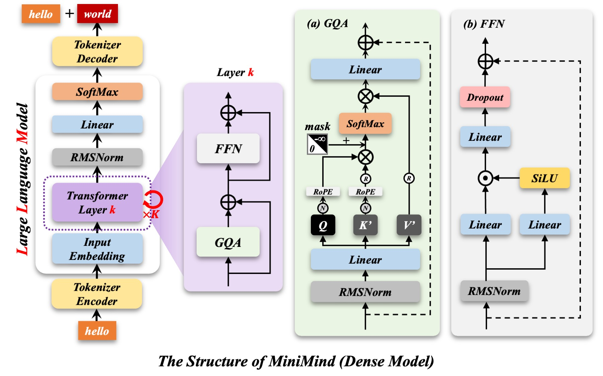
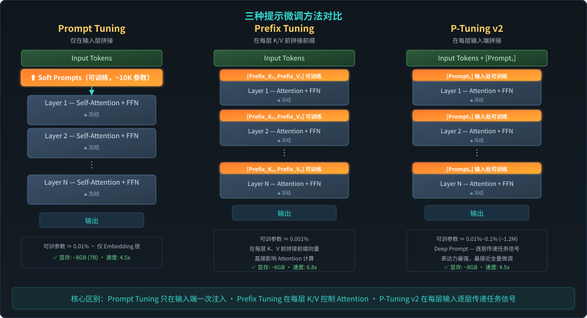

# 大模型微调技术：从 SFT 到强化学习对齐

> **课程性质**：公开课讲义 / 完整参考教材  
> **主讲人**：王显宗  
> **日期**：2026 年 6 月 3 日  
> **课程时长**：约 90–120 分钟  
> **面向对象**：有一定基础的软件工程学生、AI 工程师  
> **前置知识**：Transformer 基本结构、梯度下降与反向传播、概率论基础  
> **版本**：v1.0

---

## 目录

1. [课程导言：为什么需要微调](#1-课程导言为什么需要微调)
   - 1.1 问题引入：大模型"不听话"
   - 1.2 追根溯源：预训练模型的三个根本局限
   - 1.3 微调的定义与本质
   - 1.4 微调 vs 其他适配手段
   - 1.5 微调技术全景图
   - 1.6 本课四条主线

2. [监督微调（SFT）](#2-监督微调sft)
   - 2.1 核心思想：模仿学习
   - 2.2 数据格式与对话模板
   - 2.3 常用 SFT 数据集
   - 2.4 训练目标：交叉熵损失
   - 2.5 冰山理论：看得见的行为与看不见的知识激活
   - 2.6 关键超参数
   - 2.7 SFT 的优势与局限
   - 2.8 SFT 与其他方法的关系

3. [提示微调（Prompt Tuning）](#3-提示微调prompt-tuning)
   - 3.1 从离散提示到连续提示
   - 3.2 Prompt Tuning（Lester et al., 2021）
   - 3.3 Prefix Tuning（Li & Liang, 2021）
   - 3.4 P-Tuning v2（Liu et al., 2022）
   - 3.5 三种方法对比
   - 3.6 多任务切换：提示微调的杀手锏
   - 3.7 优势与局限

4. [LoRA：低秩适配](#4-lora低秩适配)
   - 4.1 问题背景：全量微调的瓶颈
   - 4.2 核心假设：权重更新的低秩性
   - 4.3 数学原理：$W = W_0 + \frac{\alpha}{r}BA$
   - 4.4 初始化策略与缩放因子 α
   - 4.5 目标层选择与实践配置
   - 4.6 训练与推理流程：Merge 机制
   - 4.7 QLoRA：4-bit 量化 + LoRA
   - 4.8 LoRA 变体对比
   - 4.9 代码示例与实践建议
   - 4.10 LoRA 的局限与注意事项

5. [强化学习微调](#5-强化学习微调)
   - 5.1 为什么 SFT 之后还需要 RL？
   - 5.2 强化学习基础概念
   - 5.3 基于策略的方法：REINFORCE 到 PPO
   - 5.4 Actor-Critic 方法
   - 5.5 RLHF：经典三阶段流程
   - 5.6 DPO：直接偏好优化
   - 5.7 GRPO：群体相对策略优化
   - 5.8 DAPO 与 RLVR：2025-2026 前沿
   - 5.9 LLM 对齐方法全景对比
   - 5.10 2026 年推荐后训练管线

6. [总结与实践](#6-总结与实践)
   - 6.1 四种方法核心定位
   - 6.2 方法速查表
   - 6.3 入门路线与进阶路线
   - 6.4 工具推荐
   - 6.5 核心 Takeaways

7. [附录](#附录)
   - A. 必读论文
   - B. 2025-2026 前沿进展
   - C. 硬件选型参考
   - D. 参考资源

---

## 1. 课程导言：为什么需要微调

### 1.0 前置回顾：大模型的基本结构

在深入微调技术之前，先回顾一下现代大语言模型的基础架构——**Transformer**。几乎所有主流大模型（GPT、LLaMA、Qwen、DeepSeek 等）都建立在 Transformer 架构之上。



Transformer 的核心由两大部分组成：

- **Encoder（编码器）**：通过多头自注意力（Multi-Head Self-Attention）和前馈网络（Feed-Forward Network），将输入序列编码为富含上下文信息的隐藏表示。每个 Encoder 层包含 Self-Attention → Add & Norm → FFN → Add & Norm 的子层结构。
- **Decoder（解码器）**：自回归地生成输出序列。与 Encoder 不同，Decoder 使用 **Masked Self-Attention**（防止看到未来 token），并通过 **Cross-Attention** 关注 Encoder 的输出。GPT 系列模型仅使用 Decoder 部分。

关键组件说明：

| 组件 | 作用 |
|------|------|
| **Multi-Head Attention** | 让模型从多个表示子空间同时关注输入的不同位置，是 Transformer 的核心计算单元 |
| **Layer Normalization** | 稳定深层网络训练，减少内部协变量偏移 |
| **残差连接（Residual Connection）** | 允许梯度直接流过深层网络，缓解梯度消失问题 |
| **Feed-Forward Network（FFN）** | 对每个位置的表示进行非线性变换，增强模型的表达能力 |
| **Positional Encoding** | 注入序列位置信息（因为 Attention 本身是位置无关的） |

现代 Decoder-only 大模型（如 GPT、LLaMA）将这些组件堆叠数十到上百层，参数量从数亿到数千亿不等。**微调的本质就是在这庞大的参数空间中，找到最小但最关键的变化方向，使模型行为适配特定任务。**

### 1.1 问题引入：大模型"不听话"

考虑以下两个真实场景：

**场景一**：你要求大模型"提取信息并仅输出 JSON 格式：`{"name": "...", "age": ...}`"，它却回复了一长段礼貌寒暄，其中夹杂着 JSON——格式正确，但行为不符合"仅输出 JSON"的约束。

**场景二**：你要求"使用 Python 实现快速排序，不要有任何解释，只输出代码"，它却从算法思想开始，洋洋洒洒写了几百字的解释。

这两个场景暴露了同一个核心问题：**大模型"有能力"，但"行为"没有被约束到用户真正需要的输出形态上。** 模型拥有完成任务的底层知识，但它不懂得何时该简洁、何时该详细、何时该严格遵循格式约束。

### 1.2 追根溯源：预训练模型的三个根本局限

大语言模型在预训练阶段从海量互联网文本中学习通用语言能力，但这一过程天然带来三个问题：

| 问题 | 根源 | 表现 |
|------|------|------|
| **知识泛而不精** | 预训练数据来自全网通用文本，覆盖面广但缺乏垂直深度 | 在法律、医疗、金融等专业领域只能给出泛泛之谈，缺乏精准任务经验 |
| **格式不受控** | 预训练以 Next Token Prediction 为目标，天然偏向自然语言续写 | 对 JSON、代码块、结构化 Schema 缺乏硬性逻辑约束意识 |
| **偏好未对齐** | 互联网文本包含低质量、偏见甚至有害内容，模型学到的是统计相关性 | 可能生成不安全、不符合人类价值观的内容 |

预训练回答的是"下一个最可能的 token 是什么"，而用户需要的是"针对我的指令，最合适的回答是什么"。这两个目标之间存在严重落差。

### 1.3 微调的定义与本质

**微调（Fine-Tuning）** 是在预训练模型的基础上，使用**少量、高质量、特定领域**的数据进行继续训练，使模型适配下游任务的过程。

微调的核心特征：

- **少量高质量数据**：区别于预训练阶段的海量原始文本，微调通常只需数千条精心标注的数据对。**数据质量远比数据数量关键。**
- **针对特定任务**：通过学习任务指令，使模型从通用语言续写者转变为专业任务执行者（如法律咨询、代码生成、格式输出）。
- **改变行为而非结构**：保持模型的基础架构和核心知识体系不变，重点调整其响应风格、格式规范和对人类指令的遵循程度。

### 1.4 微调 vs 其他适配手段

在实际工程中，解决大模型行为问题的手段不止微调一种。以下是几种主流方案的对比：

```
提示工程  →  RAG（检索增强生成）  →  微调  →  全量微调
（零成本）     （低成本）              （中等成本）    （高成本）
    ↓              ↓                    ↓             ↓
 越简单越低层                         越复杂越深层
```

| 方法 | 成本 | 效果上限 | 核心机制 | 适用场景 |
|------|------|---------|----------|----------|
| **提示工程** | 零 | 低 | 设计输入指令，不改变模型参数 | 简单任务、快速验证、格式约束不严格 |
| **RAG（检索增强）** | 低 | 中 | 将外部知识库与生成模型结合 | 知识密集型、事实性要求高、知识需要频繁更新 |
| **微调（PEFT）** | 中 | 高 | 用特定任务数据更新少量参数 | 指令遵循、输出格式控制、风格适配、领域行为调整 |
| **全量微调** | 高 | 最高 | 更新全部参数 | 极端定制化需求、数据量充足的场景 |

**决策原则**：
- 如果问题是"缺资料"（知识陈旧、事实幻觉） → 优先考虑 RAG
- 如果问题是"行为模式不稳定"（不遵循格式、风格不匹配） → 优先考虑微调
- 如果只是简单的一次性任务 → 提示工程往往足够
- 如果需要深层行为改变且要求最高效果 → 全量微调

### 1.5 微调技术全景图

```
微调技术
├── 全量微调（Full Fine-Tuning）
│   └── 更新所有参数，效果上限最高，显存需求最大
├── 监督微调（SFT）
│   └── 在人工标注的 (指令, 回答) 数据上训练——所有高级方法的起点
├── 参数高效微调（PEFT）
│   ├── 加法类：LoRA / QLoRA / AdaLoRA / DoRA / Delta-LoRA
│   ├── 提示类：Prompt Tuning / P-Tuning v2 / Prefix Tuning
│   ├── 适配器类：Adapter / AdapterFusion / (IA)³
│   └── 稀疏类：GAST / IST / Spectrum
└── 偏好对齐
    ├── RLHF + PPO（在线对齐，ChatGPT 的经典方案）
    ├── DPO / SimPO / KTO / ORPO（离线对齐）
    ├── GRPO / DAPO（推理 RL，DeepSeek-R1 的核心）
    └── RLVR（2025-2026 前沿：可验证奖励驱动推理）
```

### 1.6 本课四条主线

本课程聚焦四个核心技术方向，覆盖从入门到前沿的完整路径：

| 主线 | 定位 | 核心思想 |
|------|------|----------|
| **SFT（监督微调）** | 基础必做 | 通过"指令-回答"对，让模型学会任务遵循能力与表达方式 |
| **Prompt Tuning（提示微调）** | 轻量补充 | 冻结模型主体，用梯度下降学习最优的连续提示向量 |
| **LoRA（低秩适配）** | 工业主流 | 基于权重更新的低秩特性，以极低算力实现接近全量微调的效果 |
| **RL 系列（强化学习）** | 推理增强 | 引入奖励机制（DPO/GRPO/RLVR），让模型在自主探索中超越数据上限 |

---

## 2. 监督微调（SFT）

### 2.1 核心思想：模仿学习

**Supervised Fine-Tuning (SFT)** 是最经典、最基础的微调范式。它的本质是**模仿学习（Imitation Learning）**：给定一组高质量的"指令-回答"数据对，以标准的语言模型训练目标（下一个 token 预测）来更新模型参数，使模型学会在给定指令时输出符合期望的回答。

```
SFT 的三要素：
├── 输入 (Instruction)：明确的任务描述或问题，如"请写一个快速排序程序"
├── 标准回答 (Response)：人类认可的高质量回复，模型学习的"金标准"
└── 行为映射：模型学习到"当用户说'请实现'时 → 应该直接输出代码"
```

**关键直觉**：SFT 让模型从"续写任何文本"转变为"根据指令提供正确回答"。它不是教会模型新知识，而是教会模型在正确的时机调用已有知识。

### 2.2 数据格式与对话模板

SFT 的数据组织通常遵循**对话模板（Chat Template）**，以保证训练格式与推理格式严格一致：

```
<|system|>你是一个有帮助的编程助手。<|end|>
<|user|>用 Python 写一个快速排序。<|end|>
<|assistant|>def quicksort(arr):
    if len(arr) <= 1:
        return arr
    pivot = arr[len(arr) // 2]
    left = [x for x in arr if x < pivot]
    middle = [x for x in arr if x == pivot]
    right = [x for x in arr if x > pivot]
    return quicksort(left) + middle + quicksort(right)<|end|>
```

**关键数据原则**：

1. **Mask 策略**：通常只在 Assistant 的回复部分计算损失（mask 掉 System 和 User token），模型优化的目标是"如何生成好的回答"而非"重复提问文本"。
2. **格式一致**：训练时的对话模板必须与推理时的 Chat Template 保持完全一致。
3. **质量优先**：**几千条高质量样本的效果往往优于几万条低质量样本**。数据质量（正确性、一致性、覆盖面）比数量更重要。

### 2.3 常用 SFT 数据集

| 数据集 | 规模 | 特点 |
|--------|------|------|
| Alpaca | 52K | GPT-3.5 生成的通用指令数据，入门首选 |
| Dolly-15k | 15K | 人工标注，Databricks 出品，质量可靠 |
| OpenAssistant | 161K | 多语言、社区众包，覆盖广 |
| ShareGPT | 90K | 真实用户与 ChatGPT 的多轮对话 |
| CodeAlpaca | 20K | 代码生成专用 |
| GSM8K | 8.5K | 数学推理，包含解题步骤 |
| Anthropic HH-RLHF | 170K | 偏好对齐数据，用于 RLHF/DPO |
| UltraFeedback | 64K | 高质量偏好对齐数据 |

### 2.4 训练目标：交叉熵损失

SFT 使用的损失函数仍然是语言模型的标准训练目标——**交叉熵损失（Cross Entropy Loss）**：

$$\mathcal{L}_{SFT} = -\frac{1}{N}\sum_{i=1}^{N} \log P_\theta(y_i \mid x, y_{<i})$$

其中 $x$ 是指令/上下文部分，$y = (y_1, \ldots, y_T)$ 是目标回答的 token 序列。

**直觉**：模型逐 token 学习提高"标准答案"出现的条件概率。如果一个回答在训练集中是"金标准"，SFT 会让模型在看到同样指令时更倾向于生成这个回答中的 token。

**Completion-only Loss**：在实际工程中（如使用 `SFTTrainer`），聊天数据经模板拼接后，通常只对 assistant 的回答 token 计算损失，对 system/user token 做 loss mask。这样模型优化的方向是"如何回答"，而非背诵提问文本。

### 2.5 冰山理论：看得见的行为与看不见的知识激活

SFT 表面上在做一件简单的事——"模仿"标注数据中的回答格式和风格。但实际上发生了两个层次的变化，这被称为 **SFT 的冰山理论**：

```
水面以上（看得见的行为）：
  ├── 学习输出格式（JSON、Markdown、代码块、表格等结构化格式）
  ├── 学习对话风格（语气、详略程度、角色扮演方式）
  └── 学习任务遵循（看到"请实现"→触发"直接给代码"的行为映射）

水面以下（看不见的能力）：
  └── 激活预训练知识：让模型学会在正确的情境下"回忆"已有知识
```

**关键结论：SFT 主要不是注入新知识，而是激活和格式化已有知识。** 如果模型在预训练阶段从未见过某个领域的内容，SFT 几乎无法教会它。这就是为什么注入大量新知识需要继续预训练（Continual Pre-training）而非 SFT。

### 2.6 关键超参数

| 参数 | 典型值 | 说明 |
|------|--------|------|
| 学习率（Learning Rate） | 1e-5 ~ 5e-5 | 比预训练低 1-2 个数量级，避免破坏已有知识 |
| Epoch | 1 ~ 3 | SFT 容易过拟合，通常 1-2 个 epoch 足够 |
| Batch Size | 32 ~ 128 | 受显存限制，可通过梯度累积等效增大 |
| Warmup Ratio | 0.03 ~ 0.1 | 避免训练初期梯度震荡 |
| Max Length | 2048 / 4096 | 根据任务需要截断，截断时注意勿误删答案 |
| Packing | 可选 | 将短样本拼接成完整序列，提高 GPU 利用率 |

### 2.7 SFT 的优势与局限

**优势**：

1. **简单直接**：遵循"模仿学习"范式，逻辑清晰。只需准备"指令-回答"对，无需复杂的奖励建模或策略迭代。
2. **效果稳定**：训练过程收敛快，结果高度可预期。能够精准控制模型的输出格式和回复风格。
3. **工程成熟**：底层基于标准交叉熵损失，拥有最完善的开源工具链（TRL、LLaMA-Factory、Unsloth）支持。
4. **工业标准地位**：无论 LoRA 还是 RLHF/DPO，通常都需先进行 SFT"打底"，激活模型的指令遵循能力。

**局限**：

1. **高度依赖数据质量**：Garbage In, Garbage Out——数据质量是 SFT 效果的天花板。
2. **容易产生过拟合**：训练 epoch 过多时，模型会"背诵"训练数据而非泛化。通常 1-3 个 epoch 足够。
3. **无法超越数据上界**：SFT 本质是模仿学习，模型表现受限于标注数据的质量水平。如果标注者水平一般，模型学到的也就是一般水平。
4. **灾难性遗忘风险**：在特定领域训练过多会丧失通用对话能力。缓解措施：混入 10-30% 通用指令数据。
5. **不擅长注入大量新知识**：如需让模型掌握全新领域的事实性知识，应使用继续预训练（Continual Pre-training）或 RAG。

### 2.8 SFT 与其他方法的关系

SFT 是后训练管线的基础，而非终点：

```
预训练模型（Base Model）
  → SFT（学会按指令格式回答，激活已有知识）
  → DPO/RLHF（偏好对齐：学会安全、有用、符合风格的表达）
  → GRPO/RLVR（推理强化：学会推理、反思、验证）
```

> **重要区分**：SFT 是训练目标/数据范式，LoRA 是更新参数的方式，两者不是互斥关系。常见组合包括：SFT + 全参数更新、SFT + LoRA、SFT + QLoRA。

---

## 3. 提示微调（Prompt Tuning）

### 3.1 从离散提示到连续提示

**传统 Prompt 工程**的核心问题是：人工设计的离散 Prompt 存在三个根本瓶颈：

1. **严重的不稳定性**：同义词替换可能导致性能骤降，不同措辞让模型表现巨大波动。
2. **表达能力的瓶颈**：自然语言作为输入载体，在表达精确语义时存在天然限制。文字难以精确对齐高维词向量空间。
3. **难以利用梯度优化**：离散 Token 无法直接参与反向传播，优化过程属于昂贵的"离散搜索"。

**提示微调的核心创新**：用一组**可训练的连续向量（Soft Prompt / Continuous Prompt）** 替代离散的文字提示词。这些向量不再对应具体的自然语言词汇，而是在高维嵌入空间中通过梯度下降自动搜索最优表示。

```
传统 Prompt：  [The, movie, was, great]  →  Encoder  →  [分类器]
                ↑ 离散 Token，靠人工试错

Soft Prompt：  [P1, P2, P3, Input_Tokens]  →  Encoder（Frozen）  →  输出
                ↑ 可训练连续向量，通过梯度下降自动优化
```

**核心价值**：用极少参数在高维嵌入空间中搜索最优的任务表示——而不需要人工反复试验。

**参数冻结策略**：这是 PEFT 的核心——模型主体参数完全冻结，仅训练少量提示向量。优势包括：显存占用极低（仅存储梯度相关向量），防止灾难性遗忘（原始通用能力得到保留）。

### 3.2 Prompt Tuning（Lester et al., 2021）

最轻量的提示微调方法：

- **作用位置**：仅在 Embedding 输入层拼接可学习向量
- **模型参数**：完全冻结
- **可训参数量**：极低（~0.01%，约 10K 个参数）

```
[Soft_Prompt_1, ..., Soft_Prompt_N, Input_Token_1, ..., Input_Token_M]
        ↑ 可训练（~10K 参数）                       ↑ 固定（~7B 参数）
```

**关键发现**：Prompt Tuning 的效果与模型规模高度正相关——**小于 1B 参数的模型效果较差，10B+ 模型的效果接近全量微调。** 原因是大模型有更强的"泛化井"（generalization well）——更大的内部表示空间可以容纳软提示携带的任务信息。

### 3.3 Prefix Tuning（Li & Liang, 2021）

- **作用位置**：在**每一层** Transformer 的 Key 和 Value 之前拼接可训练前缀向量
- **可训参数量**：~0.001%（约 122K）

```
对于第 i 层 Transformer：
  K_i = [Prefix_K_i; K_i_from_input]
  V_i = [Prefix_V_i; V_i_from_input]
  Attention(Q, K, V) = softmax(Q @ K^T / sqrt(d)) @ V
```

与 Prompt Tuning 只在输入层不同，Prefix Tuning 在**所有层**注入可学习信号，因此对深层行为的控制力更强。在长文本生成任务（如摘要）中表现尤其突出，ROUGE-L 提升可达 28%。

### 3.4 P-Tuning v2（Liu et al., 2022）

- **作用位置**：在每一层的**输入处**添加可训练的连续提示向量（Deep Prompt Tuning）
- **可训参数量**：0.01%~0.1%（约 1.2M）

与 Prefix Tuning 的关键区别：
- Prefix Tuning 拼在 K/V 上，直接影响 attention 计算
- P-Tuning v2 拼在输入上，影响整个层的计算

P-Tuning v2 在结构化文本任务（如关系抽取、命名实体识别）中表现优异，效果最接近全量微调。

### 3.5 三种方法对比

三种提示微调方法的核心区别在于**可训练向量的插入位置**——这直接决定了它们对模型行为的控制力：



**架构层面的差异**：

```
Prompt Tuning：     [P1..Pn] → [Layer1] → [Layer2] → ... → [LayerN] → 输出
                    ↑ 只在输入层

Prefix Tuning：     Input → [P_K1, P_V1] → [P_K2, P_V2] → ... → 输出
                           ↑ 每层 K/V 前拼接

P-Tuning v2：       [P1] → Layer1 → [P2] → Layer2 → ... → [Pn] → LayerN → 输出
                    ↑ 每层输入处拼接
```

**定量对比**：

| 方法 | 插入位置 | 可训参数 | 显存（7B） | 训练速度 | 最佳场景 |
|------|---------|----------|-----------|---------|----------|
| **Prompt Tuning** | 输入 Embedding 层 | ~0.01% | ~8GB | 4.5x | 大模型（10B+）多任务切换 |
| **Prefix Tuning** | 每层 K/V 前缀 | ~0.001% | ~6GB | 6.8x | 长文本生成、摘要任务 |
| **P-Tuning v2** | 每层输入端 | ~0.1% | ~8GB | 4.5x | 结构化理解任务（NER、关系抽取） |

### 3.6 多任务切换：提示微调的杀手锏

提示微调最独特的优势是**多任务零成本切换**。每个任务只需保存一个提示向量文件（几 KB 到几 MB），基础模型只需加载一次：

```
推理服务架构（多任务部署）：
  基础模型（7B 参数，~14GB/FP16）—— 加载到 GPU，全局共享
  ├── 翻译任务 Prompt 向量（~10KB）
  ├── 摘要任务 Prompt 向量（~10KB）
  ├── 分类任务 Prompt 向量（~10KB）
  └── 问答任务 Prompt 向量（~10KB）

  热切换开销：近乎为零（仅需替换输入前缀向量）
```

这在**边缘设备或移动端**场景中极为重要——模型只需存一份，不同任务通过热切换 Prompt 向量实现。同时，训练数据不直接更新模型参数，对数据的"记忆"更间接，**隐私保护**方面也有优势。

### 3.7 优势与局限

**优势**：
1. 参数量极低，显存占用极小
2. 多任务切换零成本（模型只需一份）
3. 隐私保护更友好（数据不直接写入模型权重）

**局限**：
1. **小型模型效果差**：< 1B 参数的模型，Prompt Tuning 效果远不如 LoRA 或全量微调
2. **收敛慢**：通常需要比 LoRA 更多的训练步数
3. **表达能力有限**：软提示向量的参数空间远小于 LoRA 的低秩矩阵，精细度不如 LoRA
4. **不适合注入新知识**：与 SFT 类似，提示微调主要调整行为而不注入大量新知识

---

## 4. LoRA：低秩适配

### 4.1 问题背景：全量微调的瓶颈

全量微调面临三个现实约束：

| 瓶颈 | 具体表现 |
|------|----------|
| **显存需求爆炸** | 13B 模型全量微调需约 50GB+ 显存（权重 + 梯度 + 优化器状态） |
| **参数规模巨量** | 以 Llama-65B 为例，全量微调需 ~780GB 显存——需要 10 张 A100 |
| **存储与部署成本** | 每个微调任务都产生一个完整模型副本（~14GB/7B 模型），"一任务一模型"方案在经济上不可持续 |

**核心问题**：真的需要更新所有参数吗？LoRA 的答案是：**不需要**。

### 4.2 核心假设：权重更新的低秩性

LoRA 基于一个关键观察：

> **预训练模型在适配下游任务时，权重更新矩阵 $\Delta W$ 具有低"本征秩"（intrinsic rank）。**

这意味着：虽然模型的权重矩阵维度很高（比如 4096 x 4096），但真正发生变化的只有少数几个"方向"。模型适配任务的过程中，大部分参数的变化是同步的、线性相关的。**权重更新是低秩的——可以用两个小矩阵的乘积来近似。**

### 4.3 数学原理：$W = W_0 + \frac{\alpha}{r}BA$

设预训练权重为 $W_0 \in \mathbb{R}^{d \times k}$，权重更新为 $\Delta W$：

$$\Delta W = B \cdot A$$

其中 $B \in \mathbb{R}^{d \times r}$，$A \in \mathbb{R}^{r \times k}$，且 $r \ll \min(d, k)$。

加入缩放因子 $\alpha$：
$$h = W_0 x + \frac{\alpha}{r} \cdot B A x$$

**参数量对比**（以 $d = k = 4096, r = 16$ 为例）：

```
原权重 W₀（冻结）：    [4096 × 4096]   ≈ 16.8M 参数
低秩矩阵 B（可训练）：  [4096 × 16]     ≈ 65K 参数
低秩矩阵 A（可训练）：  [16 × 4096]     ≈ 65K 参数
                              总计可训 ≈ 130K（原参数的 ~0.0008%）
```

参数效率提升可达 **10,000 倍以上**。

### 4.4 初始化策略与缩放因子 $\alpha$

**初始化策略**：
- **A 矩阵**：高斯初始化（较小的标准差，如 0.02）
- **B 矩阵**：**全零初始化**

这样在训练开始时 $\Delta W = BA = 0$，模型输出完全等同于预训练模型，保证训练初期的稳定性。随着训练推进，B 逐渐从零学习任务特定的更新方向。

**缩放因子 $\alpha/r$**：

| $r$ | $\alpha$（推荐值） | $\alpha/r$ | 效果 |
|-----|-------------------|-----------|------|
| 8 | 16 | 2 | 默认入门配置 |
| 16 | 32 | 2 | 标准配置，表达力与效率的平衡点 |
| 32 | 64 | 2 | 大型数据集，更强表达力 |
| 64 | 128 | 2 | 接近全量微调效果 |

**$\alpha$ 的含义**：当 $r$ 增大时，低秩矩阵的 Frobenius 范数倾向于增大，$\alpha$ 起到"学习率缩放"的作用。通常保持 $\alpha/r$ 的比值恒定（常设为 2），使更高秩的更新获得相应更大的学习率强度。

### 4.5 目标层选择与实践配置

LoRA 最初应用在注意力层的 **Query（Q）和 Value（V）** 投影矩阵上：

```
Multi-Head Attention:
  Q = W_Q @ x    ← 可加 LoRA（输出概率分布依赖 Q）
  K = W_K @ x    ← 冻结（或选择性施加）
  V = W_V @ x    ← 可加 LoRA（直接影响输出内容）
  O = W_O @ x    ← 冻结（或扩展配置中施加）

Feed-Forward Network:
  gate_proj, up_proj, down_proj  ← 通常冻结（或追求最大效果时施加）
```

**实践建议（按从简到繁）**：

| 配置等级 | 目标模块 | rank $r$ | $\alpha$ | 适用场景 |
|----------|---------|----------|----------|----------|
| **最小配置** | q_proj + v_proj | 8 | 16 | 入门实验、小数据集、快速验证（效果已达全量 90%+） |
| **标准配置** | q_proj + v_proj + o_proj | 16 | 32 | 大多数场景的最佳性价比 |
| **增强配置** | q + k + v + o + gate_proj | 32 | 64 | 大任务、追求最佳效果 |
| **最大配置** | 所有线性层 | 64+ | 128+ | 极限效果，参数约 1% |

**门控模型（LLaMA、Qwen 等）** 额外对 `gate_proj` 施加 LoRA 通常有显著收益。

### 4.6 训练与推理流程：Merge 机制

**训练阶段**：

```
Step 1: FREEZE——冻结原始模型权重 W₀，确保预训练知识不被破坏
Step 2: TRAIN——仅对旁路低秩矩阵 A 和 B 进行梯度更新
        显存开销极低（可训参数仅 0.1-1%），训练状态高度稳定
```

**推理阶段——Weight Merge**：

训练完成后，将 $\Delta W$ **合并到原权重中**：

$$W_{merged} = W_0 + \frac{\alpha}{r}BA$$

合并后与原始模型完全等价，**零额外推理延迟**。这是 LoRA 相对于 Adapter 方法的重大优势——Adapter 会在推理时引入额外的序列计算开销。

```
推理流程：
  LoRA 适配器文件（.bin, ~30MB）
       ↓
  merge_and_unload()
       ↓
  完整模型（.safetensors, ~14GB）
       ↓
  标准推理（无任何额外开销）
```

**模型"补丁"比喻**：原模型像"操作系统"，处于冻结状态不改动本体。LoRA 像"小型补丁"，只在关键节点添加一层修正，极其轻量且即插即用，不引入额外推理延迟。

### 4.7 QLoRA：4-bit 量化 + LoRA

QLoRA 是 LoRA 家族中**工业落地最广泛**的变体，核心创新是将基础模型以 4-bit 量化后训练 LoRA：

| 技术组件 | 原理 | 效果 |
|----------|------|------|
| **NF4（4-bit NormalFloat）** | 利用模型权重的正态分布特性，设计信息论最优的 4-bit 量化格式 | 在维持精度的同时将内存压缩至 4-bit/参数 |
| **双重量化（Double Quantization）** | 对量化常数本身再次进行量化 | 每参数额外节省约 0.4 bit |
| **分页优化器（Paged Optimizers）** | 利用 NVIDIA 统一内存技术，显存峰值溢出时自动将优化器状态转移至 CPU | 防止 OOM 崩溃 |

**显存对比**（以 Llama-65B 为例）：

```
全量微调：~780 GB  →  需要 10 张 A100（80GB）
LoRA：    ~160 GB  →  需要 2 张 A100
QLoRA：   ~48 GB   →  单张 A100 或 RTX 3090 即可
```

**2026 年实践**：QLoRA 让消费级 GPU（RTX 3090/4090，24GB）微调 7B-13B 模型成为现实，这是个人开发者进入大模型微调的最重要技术基础。

### 4.8 LoRA 变体对比

| 变体 | 核心改进 | 相对标准 LoRA 的提升 | 论文 |
|------|---------|---------------------|------|
| **QLoRA** | + 4-bit NF4 量化 + 双重量化 + 分页优化器 | 显存再降 60-70% | Dettmers et al., NeurIPS 2023 |
| **LoRA+** | A 和 B 使用不同学习率（$\lambda_B = 16 \times \lambda_A$） | 训练效率 2x | Hayou et al., 2024 |
| **AdaLoRA** | 动态调整各层秩 $r$（重要层高秩，次要层低秩） | 同等参数量下效果更优 | Zhang et al., 2023 |
| **DoRA** | 将权重分解为"幅度" + "方向"，仅对方向做 LoRA | 更接近全量微调（~98%） | Liu et al., 2024 |
| **Delta-LoRA** | 同时更新原始权重（梯度通过 $\Delta W$ 传播到 $W_0$） | 表达能力更强 | Zi et al., 2023 |

### 4.9 代码示例与实践建议

使用 Hugging Face PEFT 库的最简示例：

```python
from peft import LoraConfig, get_peft_model, TaskType
from transformers import AutoModelForCausalLM

model = AutoModelForCausalLM.from_pretrained("meta-llama/Llama-3-8B")

lora_config = LoraConfig(
    task_type=TaskType.CAUSAL_LM,
    r=16,                        # 秩
    lora_alpha=32,               # 缩放因子
    lora_dropout=0.05,           # Dropout 防止过拟合
    target_modules=["q_proj", "v_proj", "o_proj"],  # 目标层
)

model = get_peft_model(model, lora_config)
model.print_trainable_parameters()
# 输出: trainable params: 39,976,960 || all params: 8,070,273,024 || trainable%: 0.4953
```

**实践建议**：

1. 新手推荐配置：`r=16, alpha=32, target=["q_proj", "v_proj"], dropout=0.05`
2. 学习率：LoRA 可使用高于全量 SFT 的学习率（典型值 `1e-4` 到 `2e-4`）
3. 建议实验：固定数据集对比 `r=8/16/32` 的验证表现；固定 rank 对比不同 target modules 组合

### 4.10 LoRA 的局限与注意事项

1. **秩的选择是经验性的**：$r$ 过大浪费资源，$r$ 过小欠拟合。$r=8$ 或 $16$ 是可靠的起点。
2. **LoRA 擅长风格/格式适配，不擅长注入大量新知识**：大量新知识应通过继续预训练或 RAG 注入。
3. **多适配器合并时可能互相干扰**：多个 LoRA 适配器直接合并可能导致性能下降。需要多任务支持时可考虑 LoRA MoE 或保留独立 adapter 动态加载。
4. **训练和推理需要相同的 $\alpha/r$**：若训练时 $\alpha=32, r=16$，合并后改变了 $\alpha/r$ 比值，效果可能不稳定。
5. **不减少上下文/激活显存**：LoRA 减少的是**可训练参数及相关训练开销**，不是基础模型的前向激活显存。长序列和 batch size 仍会影响显存使用。

---

## 5. 强化学习微调

### 5.1 为什么 SFT 之后还需要 RL？

SFT 让模型"会说话"，但存在两个根本性的能力边界：

| SFT 的根本局限 | 具体表现 |
|---------------|----------|
| **无法超越标注水平** | SFT 本质是模仿学习，模型学不会比标注数据更好的策略。如果标注者水平一般，模型的上限也就确定了。 |
| **缺乏探索能力** | SFT 只在标注数据上做最大似然估计，不鼓励模型尝试不同的解题路径。模型无法"发现"更优解。 |
| **无法处理模糊偏好** | 安全性、幽默感、客观性等模糊概念难以用简单的"指令-回答"对来定义。 |

强化学习的引入价值：

- **自主发现更优解**：通过"尝试-反馈"循环，模型能自主优化解题步骤，实现**超越人类标注水平的表现**。
- **复杂偏好对齐**：处理难以用文字描述的指令细节（如安全性、语气风格等模糊价值判断）。
- **可验证能力增强**：在数学和代码场景中，利用外部反馈信号（运行结果、答案校验）进行持续自我进化。

```
SFT：  "学老师怎么做"—— 模仿
RL：   "自己试，做对了给糖，做错了惩罚"—— 探索 + 利用
```

### 5.2 强化学习基础概念

将文本生成视为序列决策过程（Sequential Decision Making）：

| RL 概念 | 符号 | 在大模型中的对应 |
|---------|------|-----------------|
| **状态（State）** | $s_t$ | 当前 prompt + 已生成的 token 序列 |
| **动作（Action）** | $a_t$ | 从词表中选择下一个 token |
| **策略（Policy）** | $\pi_\theta(a \mid s)$ | LLM 输出的 token 概率分布 |
| **奖励（Reward）** | $r_t$ | 奖励模型打分 / 规则验证结果 / 人工偏好 |
| **价值函数（Value）** | $V(s)$, $Q(s,a)$ | 对当前状态/动作未来累积回报的估计 |
| **回报（Return）** | $G_t$ | 从时刻 $t$ 开始的累积折扣奖励：$G_t = \sum_{k=0}^\infty \gamma^k r_{t+k}$ |

### 5.3 基于策略的方法：REINFORCE 到 PPO

#### 为什么选择基于策略的方法？

基于价值的方法（Q-Learning / DQN）学习 Q 函数，策略由 $\arg\max_a Q(s,a)$ 隐式决定。这在**离散小动作空间**中可行（如 Atari 游戏有 4-18 个动作），但在大模型中，动作空间是整个词表（32K-128K+ token），无法用 Q 表或 Q 网络直接枚举所有 token。

**基于策略的方法**直接参数化策略 $\pi_\theta(a|s)$，输出动作的概率分布，天然适合大 token 空间。

#### REINFORCE（策略梯度基础形式）

最基础的策略梯度算法：

$$\nabla_\theta J(\theta) = \mathbb{E}_\pi\left[\sum_t \nabla_\theta \log \pi_\theta(a_t|s_t) \cdot G_t\right]$$

**直觉**：
- 如果整个序列的回报 $G_t$ 是正数 → 增大这一系列 token 的生成概率
- 如果 $G_t$ 是负数 → 减小这一系列 token 的生成概率
- 梯度方向 = "对数概率的梯度" $\times$ "回报的好坏"

**问题**：$G_t$ 的方差极大（因为每次采样的完整序列都不同），导致训练极不稳定。这是从 REINFORCE 进化到 PPO 的核心驱动力。

#### PPO（Proximal Policy Optimization）

**提出者**：Schulman et al. (2017, OpenAI)  
**地位**：策略方法的事实标准，RLHF 的核心算法

PPO 解决 REINFORCE 的两个核心问题：（1）方差大；（2）更新步长难以控制。

**改进一：优势函数（Advantage Function）替代原始回报**

$$A(s,a) = Q(s,a) - V(s)$$

优势函数衡量"这个动作比平均水平好多少"，大幅降低梯度估计的方差。

在实际实现中，使用 **GAE（Generalized Advantage Estimation）** 计算优势：

$$\hat{A}_t = \sum_{l=0}^\infty (\gamma\lambda)^l \delta_{t+l}, \quad \delta_t = r_t + \gamma V(s_{t+1}) - V(s_t)$$

其中 $\delta_t$ 为 TD 残差，$\lambda$ 控制偏差与方差的权衡。

**改进二：截断目标函数（Clipped Surrogate Objective）**

这是 PPO 最核心的创新。定义概率比率 $r_t(\theta) = \frac{\pi_\theta(a_t|s_t)}{\pi_{\theta_{old}}(a_t|s_t)}$：

$$L^{CLIP}(\theta) = \mathbb{E}_t\left[\min\left(r_t(\theta)\hat{A}_t,\ \text{clip}(r_t(\theta), 1-\varepsilon, 1+\varepsilon)\hat{A}_t\right)\right]$$

其中 $\varepsilon$ 通常取 0.1-0.2。

截断的核心直觉：

- 如果 $\hat{A}_t > 0$（这个动作好）：增大 $r_t$，但最多增大到 $1+\varepsilon$
- 如果 $\hat{A}_t < 0$（这个动作差）：减小 $r_t$，但最多减小到 $1-\varepsilon$
- 超出 $[1-\varepsilon, 1+\varepsilon]$ 区间的更新被截断，梯度为零

这确保每一步更新都不会离旧策略太远，在稳定性和表达能力之间取得极佳平衡。

### 5.4 Actor-Critic 方法

#### 核心架构

Actor-Critic 是将策略方法和价值方法结合的框架：

```
         ┌──────────┐
         │  环境/奖励  │
         └─────┬────┘
               │ r_t
    ┌──────────┼──────────┐
    │          ▼          │
    │   ┌──────────┐      │
    │   │  Critic  │ ← 评估"当前状态有多好" V(s)
    │   │ (V网络)  │      │
    │   └────┬─────┘      │
    │        │ A(s,a) = r + γV(s') - V(s)
    │        ▼            │
    │   ┌──────────┐      │
    │   │  Actor   │ ← 输出动作概率分布 π(a|s)
    │   │ (策略网络)│      │
    │   └────┬─────┘      │
    │        │ a_t        │
    └────────┼────────────┘
             ▼
```

- **Actor（策略网络/LLM）**：决定"生成什么"——输出 token 的概率分布
- **Critic（价值网络）**：评价"当前状态有多好"——估计未来期望回报 $V(s)$
- **优势函数**：$A(s,a) = r + \gamma V(s') - V(s)$，Critic 提供基线来降低 Actor 梯度的方差

#### 为何 Actor-Critic 对大模型微调至关重要？

在 RLHF 中：
- **Actor** 就是我们要微调的 LLM 本身
- **Critic** 是一个独立的（通常同规模或同结构的）神经网络，预测每个状态的期望未来奖励
- Actor 用 Critic 的优势估计来指导参数更新，避免仅靠零散的 token 级奖励信号

| 算法 | 策略类型 | 核心特点 | 在大模型中的应用 |
|------|---------|---------|-----------------|
| **A2C/A3C** | 随机 | 优势函数降低方差 | RLHF 中 Actor-Critic 框架的基础 |
| **PPO** | 随机 | 截断目标 + GAE，稳定性最优 | **RLHF 标准算法** |
| **SAC** | 随机（高斯） | 最大熵探索 | 连续控制领域，LLM 中较少使用 |
| **TD3** | 确定性 | 双 Critic 防止高估 | 确定性场景 |

### 5.5 RLHF：经典三阶段流程

RLHF（Reinforcement Learning from Human Feedback）是 ChatGPT 成功的核心技术，由 InstructGPT 论文（Ouyang et al., 2022）系统化提出。

#### 三阶段流程

```
Stage 1: SFT（监督微调）
  数据：指令 + 人类编写标准答案 (Prompt + Golden Answer)
  目标：建立基础对话能力与格式遵循
  产出：SFT 模型 = 初始策略模型

Stage 2: RM（奖励模型训练）
  数据：同一 prompt 的多个模型回复，人工排序 (Ranked: A > B > C)
  方法：使用 Bradley-Terry 模型学习人类偏好
  P(y_w ≻ y_l | x) = exp(r(x, y_w)) / (exp(r(x, y_w)) + exp(r(x, y_l)))
  损失：L_RM = -log σ(r(x, y_w) - r(x, y_l))
  产出：Reward Model（作为"裁判"）

Stage 3: PPO 强化学习
  模型生成回答 → 奖励模型打分 → PPO 更新策略
  总奖励：R_total = R_RM(x, y) - β · D_KL(π_θ || π_ref)
  KL 惩罚防止模型为了刷分而偏离太远（reward hacking）
  产出：对齐后的 Instruct LLM
```

#### 训练时的显存代价

```
训练时内存中的模型（RLHF + PPO）：
  ┌──────────┐  ┌──────────┐  ┌──────────┐  ┌──────────┐
  │ 策略模型  │  │ 参考模型  │  │ 奖励模型  │  │ 价值模型  │
  │ (Actor)  │  │ (冻结SFT) │  │  (RM)    │  │ (Critic) │
  │ 需要梯度  │  │   冻结    │  │   冻结    │  │ 需要梯度  │
  └──────────┘  └──────────┘  └──────────┘  └──────────┘
  共 4 个大模型同时驻留在 GPU 中 → 显存开销极大（~200GB/7B 模型）
```

**RLHF 的瓶颈**：
1. 需要同时加载 4 个模型（Actor + Ref + RM + Critic），显存消耗极大
2. PPO 对超参数极度敏感，训练不稳定
3. 需要大量人工标注的偏好比较数据
4. Reward Model 可能被投机性输出欺骗（reward hacking）

### 5.6 DPO：直接偏好优化

**提出者**：Rafailov et al. (2023, Stanford, NeurIPS 2023)

#### 核心洞察

RLHF 的优化目标存在闭式解——最优策略满足：

$$\pi^*(y|x) \propto \pi_{ref}(y|x) \cdot \exp\left(\frac{1}{\beta}r(x,y)\right)$$

由此可以反解出奖励函数的隐式表达，直接代入偏好损失，**绕过奖励模型和 RL 训练**：

$$\mathcal{L}_{DPO} = -\mathbb{E}_{(x,y_w,y_l)}\left[\log\sigma\left(\beta\log\frac{\pi_\theta(y_w|x)}{\pi_{ref}(y_w|x)} - \beta\log\frac{\pi_\theta(y_l|x)}{\pi_{ref}(y_l|x)}\right)\right]$$

其中 $y_w$ 是 chosen（优选回答），$y_l$ 是 rejected（劣选回答），$\pi_{ref}$ 是冻结的参考模型，$\beta$ 控制偏离强度。

**直觉解读**：
- 增大"好回答"相对于参考模型的概率
- 减小"坏回答"相对于参考模型的概率
- $\beta$ 控制偏离参考模型的程度——不是无条件增大 chosen 的概率，而是让 chosen 相对于 rejected 且相对于 reference 更占优

#### DPO vs RLHF + PPO

| 维度 | RLHF + PPO | DPO |
|------|-----------|-----|
| 训练阶段 | 3（SFT + RM + RL） | 1（直接在偏好对上优化） |
| 需加载模型数 | 4（Actor + Ref + RM + Critic） | 2（策略 + 冻结参考） |
| 训练稳定性 | 低（PPO 对超参数极敏感） | 高（监督式分类损失） |
| 计算开销 | 极高（~200GB/7B） | 低（~30GB/7B，2 个模型） |
| 在线探索 | 有（可以探索新回答） | 无（完全离线，受数据集质量限制） |
| 数据需求 | 偏好比较对 | 偏好比较对 |
| 2025-2026 地位 | 逐步被 DPO 替代 | **对齐主流方法** |

#### DPO 的重要变体

| 变体 | 核心改进 | 论文 |
|------|---------|------|
| **SimPO** | 移除参考模型，用序列平均 log-prob 作为隐式奖励，同时做长度归一化 | Meng et al., 2024 |
| **KTO** | 仅需"好/坏"二元标签，不需要成对比较（基于前景理论） | Ethayarajh et al., 2024 |
| **ORPO** | 将 SFT 和 DPO 合并为一个训练步骤，极大简化流程 | Hong et al., 2024 |
| **CPO** | 对比偏好优化，同时学习好回答的特征和坏回答的界限 | Xu et al., 2024 |

**DPO 的准确边界**：
- DPO 在**固定偏好数据的对齐训练**中，是比 PPO-RLHF 更简洁的重要选择
- DPO **不能替代** PPO 的在线探索能力——在需要环境实时反馈的场景中，两者承担的任务不同
- DPO 不需要显式训练 reward model，但其推导本身利用了隐式奖励建模关系

### 5.7 GRPO：群体相对策略优化

**提出者**：DeepSeek (2024, DeepSeekMath 论文; 2025, DeepSeek-R1)  
**地位**：推理 RL 的革命性突破，DeepSeek-R1 的核心技术

#### 核心创新：完全移除 Critic

GRPO 对 PPO 的三项关键简化：

1. **群体采样（Group Sampling）**：对每个 prompt 采样 $G$ 个回答（通常 8-64 个）
2. **可验证奖励（Verifiable Reward）**：用规则函数（非学习到的 RM）打分：
   - 数学题：最终答案是否正确
   - 代码题：是否通过单元测试
   - 逻辑题：推理链是否自洽
3. **组内相对优势（Group-relative Advantage）**——无需独立 Critic：
   $$A_i = \frac{r_i - \text{mean}(r_1, \ldots, r_G)}{\text{std}(r_1, \ldots, r_G) + \varepsilon}$$

然后用 PPO 式截断目标更新策略——**无 Critic，无价值网络，无奖励模型**。

```
GRPO 内存中的模型：
只需 1-2 个模型（策略模型 + 可选冻结参考）
无 RM、无 Critic → 显存开销仅为 RLHF 的 ~1/4
```

#### DeepSeek-R1 的革命性发现

> **纯 RL + 可验证奖励可以在没有人类标注推理轨迹的情况下，让模型涌现出推理能力**（自我反思、验证、策略调整）。

- AIME 数学竞赛得分：15.6%（基础模型） → 71%（RL 训练后） → 86.7%（多数投票）
- 模型在 RL 训练中自发学会了：
  - "等等，让我再检查一遍"（自我验证）
  - "另一种解法是..."（多路径探索）
  - 主动延长推理链以提高准确率

> **关键启示**：R1-Zero 直接跳过 SFT 进行纯 RL 训练，证明了推理能力可以通过强化学习从基础模型自发涌现。但最终产品模型 R1 仍加入了冷启动数据（少量高质量推理示例）和多阶段训练，以改善可读性和语言一致性。

#### GRPO 的代价

- 虽然去掉了 Critic，但每个 prompt 需要生成多条 completion（长推理链的 rollout 成本可能极高）
- 若一组回答全部错误，标准化奖励几乎不给出有效训练信号
- 格式/长度奖励的过度使用可能扭曲真正的推理质量
- KL 控制仍重要：防止模型为了通过验证器而严重偏离自然语言质量

### 5.8 DAPO 与 RLVR：2025-2026 前沿

#### DAPO（Decoupled Clip and Dynamic Sampling Policy Optimization）

**提出者**：字节跳动 / 清华 (2025)

针对长链推理 RL 训练的 4 项关键技术：

| 技术 | 解决的问题 |
|------|-----------|
| **Clip-Higher** | 防止训练后期策略熵坍缩（模型不再探索） |
| **Dynamic Sampling** | 过滤掉无信息量的样本（全对或全错的组） |
| **Token-level Policy Gradient** | 对长 CoT 序列的每个 token 做细粒度优化 |
| **Overlong Reward Shaping** | 对超过长度限制的截断回答给予适当惩罚 |

**成果**：在 Qwen2.5-32B 上，AIME 数学竞赛达 50 分，训练步数比 DeepSeek-R1-Zero 少 **50%**。

#### RLVR（Reinforcement Learning with Verifiable Rewards）

2025-2026 年推理 RL 的**主导范式**。核心思想：

> 对于数学、代码、逻辑推理等任务，**自动验证器**（单元测试、答案检查、证明验证）提供的奖励信号比人工标注**更快、更便宜、更一致**。

```
生产推荐分叉：
  通用对齐（对话质量、安全性、风格）：→ RLHF / DPO / SimPO
  数学/代码/逻辑推理（可自动验证）：  → GRPO / DAPO / RLVR
```

### 5.9 LLM 对齐方法全景对比

| 维度 | RLHF + PPO | DPO | GRPO | DAPO |
|------|-----------|-----|------|------|
| **奖励来源** | 学习到的 RM（人类偏好） | 偏好对中隐式 | 可验证规则/函数 | 可验证规则/函数 |
| **需人类标注？** | 是 | 是 | 否 | 否 |
| **需 Critic？** | 是 | 否 | 否 | 否 |
| **需奖励模型？** | 是 | 否 | 否 | 否 |
| **内存中模型数** | 4 | 2 | 1-2 | 1-2 |
| **在线探索？** | 是 | 否 | 是 | 是 |
| **训练稳定性** | 低 | 高 | 中高 | 中高 |
| **推理能力提升** | 有限 | 有限 | **显著** | **显著** |
| **通用对齐能力** | 优秀 | 优秀 | 差（需可验证信号） | 差 |
| **代表模型** | InstructGPT, Llama 2-Chat | Llama 3, Zephyr | DeepSeek-R1 | Qwen + DAPO |

### 5.10 2026 年推荐后训练管线

```
第一层：基础能力（格式与指令遵循）
  SFT（1-10M 样本）
  ├── 学会指令格式、对话风格、角色定位
  └── 配合 QLoRA 降低硬件门槛

第二层：偏好对齐（安全与风格）
  DPO / SimPO / KTO
  ├── 对齐人类偏好：安全性、有用性、表达风格
  ├── 训练稳定、成本低（仅需 2 个模型）
  └── 可配合 LoRA 进一步降低资源需求

第三层：推理增强（智能涌现）
  GRPO / DAPO + 可验证奖励
  ├── 激发数学推理、代码生成、逻辑验证能力
  ├── 无需人类标注推理轨迹
  └── 模型在探索中自发产生反思、多路径搜索等高级行为
```

---

## 6. 总结与实践

### 6.1 四种方法核心定位

```
需要格式化输出、遵循指令格式      →  SFT
资源有限、需要多任务切换           →  Prompt Tuning
资源有限、追求效果与成本平衡       →  LoRA / QLoRA
对齐人类偏好（安全、风格、语气）   →  DPO / SimPO
激发推理能力（数学、代码、逻辑）   →  GRPO / DAPO / RLVR
```

### 6.2 方法速查表

| 方法 | 可训参数 | 显存需求（7B） | 训练速度 | 效果 | 推理开销 | 核心场景 |
|------|---------|---------------|---------|------|---------|----------|
| **全量微调** | 100% | ~48GB | 1x | ★★★★★ | 无 | 效果至上、资源充足 |
| **SFT + LoRA** | 0.1-1% | ~12GB | 3-5x | ★★★★☆ | 无（合并后） | 工业标准配置 |
| **SFT + QLoRA** | 0.1-1% | ~4-6GB | 2-3x | ★★★★☆ | 无（合并后） | 消费级 GPU 首选 |
| **Prompt Tuning** | ~0.01% | ~8GB | 4.5x | ★★★☆☆ | 无 | 10B+ 多任务切换 |
| **P-Tuning v2** | ~0.1% | ~8GB | 4.5x | ★★★½☆ | 无 | 结构化理解任务 |
| **Prefix Tuning** | ~0.001% | ~6GB | 6.8x | ★★★☆☆ | 无 | 长文本生成 |
| **RLHF + PPO** | 100% | ~200GB（4模型） | 0.2x | ★★★★★ | 无 | 极致对齐质量 |
| **DPO** | 100% | ~30GB（2模型） | 1x | ★★★★☆ | 无 | 主流对齐首选 |
| **GRPO** | 100% | ~15GB（1模型） | 0.5x | ★★★★★ | 无 | 推理能力爆发 |
| **DAPO** | 100% | ~15GB（1模型） | 0.5x | ★★★★★ | 无 | 长链推理优化 |

### 6.3 入门路线与进阶路线

**入门路线（1-2 周即可跑通）**：

1. 用 **LLaMA-Factory** + QLoRA 做一次 SFT（选 Alpaca 数据集，Llama-3-8B 或 Qwen3-4B）
2. 将训练好的模型部署并对比微调前后的指令遵循能力和格式稳定性
3. 换一个领域数据集再做一次，感受数据质量对 SFT 效果的决定性影响
4. 尝试不同 rank（r=4/8/16/32），观察参数规模与效果的关系

**进阶路线（深入理解原理）**：

1. 对比 LoRA r=4/8/16/32/64 的效果差异，理解低秩假设的边界
2. 对比不同 target modules（仅 q+v vs q+v+o vs 全 attention vs attention+FFN）
3. 尝试 Prompt Tuning，体验多任务切换架构
4. 用 DPO + UltraFeedback 数据集做偏好对齐，观察安全性和表达风格的变化
5. 在数学或代码任务中尝试 GRPO + 可验证奖励训练

### 6.4 工具推荐

| 工具 | 核心能力 | 亮点 |
|------|---------|------|
| **[LLaMA-Factory](https://github.com/hiyouga/LLaMA-Factory)** | 统一微调框架，支持 GUI | 开箱即用，支持数十种方法，中文友好 |
| **[Unsloth](https://github.com/unslothai/unsloth)** | 训练加速，内存优化 | 2x 加速，80% 内存节省，支持 Llama/Mistral/Qwen |
| **[Hugging Face PEFT](https://github.com/huggingface/peft)** | LoRA 全系列方法 | 最灵活，社区活跃，方法最全 |
| **[Hugging Face TRL](https://github.com/huggingface/trl)** | RLHF/DPO/GRPO 训练 | 从 SFT 到 RL 的完整管线 |
| **[DeepSpeed](https://github.com/microsoft/DeepSpeed)** | 分布式训练 | ZeRO 优化器，支持百亿/千亿参数 |
| **[Axolotl](https://github.com/OpenAccess-AI-Collective/axolotl)** | 大规模微调配置管理 | 声明式 YAML 配置，可复现性强 |

### 6.5 核心 Takeaways

1. **SFT 是起点而非终点**：所有高级方法（RLHF、DPO、GRPO）都需要先做 SFT 打底，建立基础指令遵循能力。

2. **SFT 主要激活已有知识**：不要期待 SFT 能注入大量全新事实性知识——那是继续预训练的工作。SFT 的价值在于格式化输出和激活模型在正确语境中调用已有知识。

3. **数据质量远重要于数据量**：几千条精心标注的高质量样本效果往往优于几万条低质量样本。Garbage In, Garbage Out 是 SFT 的铁律。

4. **LoRA 是工业标准**：QLoRA 让个人开发者在消费级 GPU 上也能完成大模型微调。r=16, α=32, target=q_proj+v_proj 是可靠的起点配置。

5. **LoRA 推理零延迟**：训练完成后将适配器合并回原权重，推理时与全量微调模型完全等价——这是 LoRA 对 Adapter 方法的巨大优势。

6. **提示微调的杀手锏是多任务切换**：适合需要同时服务 N 个任务的在线推理服务，每个任务只需几 KB 的 Prompt 向量。

7. **DPO 替代 RLHF 做对齐**：更简单、更稳定、效果接近，计算开销仅为 RLHF 的 ~1/6。在 2025-2026 年已成为对齐方法的主流选择。

8. **GRPO 打开推理之门**：可验证奖励 + 组内比较 = 在没有人类推理标注的情况下涌现推理能力。这是 DeepSeek-R1 带来的最重要的技术启示。

9. **趋势是从单一方法到组合管线**：生产级系统推荐 SFT → DPO/SimPO → GRPO/DAPO + 可验证奖励的三段式后训练管线。

10. **微调不是"让模型记住更多"**，而是让模型更可靠地把已有能力用在正确的任务行为上。

---

## 附录

### A. 必读论文

**核心方法**：

| 序号 | 论文 | 作者/会议 | 核心贡献 | 链接 |
|------|------|----------|----------|------|
| 1 | LoRA: Low-Rank Adaptation of Large Language Models | Hu et al., ICLR 2022 | LoRA 原始论文 | [arXiv:2106.09685](https://arxiv.org/abs/2106.09685) |
| 2 | QLoRA: Efficient Finetuning of Quantized Language Models | Dettmers et al., NeurIPS 2023 | 4-bit 量化 + LoRA | [arXiv:2305.14314](https://arxiv.org/abs/2305.14314) |
| 3 | The Power of Scale for Parameter-Efficient Prompt Tuning | Lester et al., EMNLP 2021 | Prompt Tuning | [arXiv:2104.08691](https://arxiv.org/abs/2104.08691) |
| 4 | P-Tuning v2: Prompt Tuning Can Be Comparable to Fine-tuning | Liu et al., ACL 2022 | Deep Prompt Tuning | [arXiv:2110.07602](https://arxiv.org/abs/2110.07602) |
| 5 | Prefix-Tuning: Optimizing Continuous Prompts for Generation | Li & Liang, ACL 2021 | Prefix Tuning | [arXiv:2101.00190](https://arxiv.org/abs/2101.00190) |
| 6 | Proximal Policy Optimization Algorithms | Schulman et al., 2017 | PPO 原论文 | [arXiv:1707.06347](https://arxiv.org/abs/1707.06347) |
| 7 | Training language models to follow instructions with human feedback (InstructGPT) | Ouyang et al., NeurIPS 2022 | RLHF 系统化方案 | [arXiv:2203.02155](https://arxiv.org/abs/2203.02155) |
| 8 | Direct Preference Optimization: Your Language Model is Secretly a Reward Model | Rafailov et al., NeurIPS 2023 | DPO 原始论文 | [arXiv:2305.18290](https://arxiv.org/abs/2305.18290) |

**前沿方法**：

| 序号 | 论文 | 核心贡献 |
|------|------|----------|
| 9 | DeepSeekMath: Pushing the Limits of Mathematical Reasoning (Shao et al., 2024) | GRPO 算法源头 | [arXiv:2402.03300](https://arxiv.org/abs/2402.03300) |
| 10 | DeepSeek-R1: Incentivizing Reasoning Capability in LLMs via RL (2025) | GRPO + 推理涌现 | [arXiv:2501.12948](https://arxiv.org/abs/2501.12948) |
| 11 | DAPO: An Open-Source LLM Reinforcement Learning System at Scale (ByteDance/Tsinghua, 2025) | 长链推理 RL 四项关键技术 | [arXiv:2503.14476](https://arxiv.org/abs/2503.14476) |
| 12 | DoRA: Weight-Decomposed Low-Rank Adaptation (Liu et al., 2024) | 权重幅度-方向分解 | [arXiv:2402.09353](https://arxiv.org/abs/2402.09353) |
| 13 | AdaLoRA: Adaptive Budget Allocation for Parameter-Efficient Fine-Tuning (Zhang et al., 2023) | 动态秩分配 | [arXiv:2303.10512](https://arxiv.org/abs/2303.10512) |

### B. 2025-2026 前沿进展

| 方法 | 时间 | 核心思想 | 关键成果 |
|------|------|----------|----------|
| **MiCA** | 2026.04 | 利用 SVD 次要奇异向量（minor components）注入知识，而非关注主成分 | 知识获取能力是 LoRA 的 **5.9 倍**，参数量仅 LoRA 的 6%-60% |
| **ConMeZO** | 2025.11 | 零阶优化的自适应方向采样，无需反向传播 | 训练速度达 MeZO 的 **2 倍**，适合黑盒 API 微调 |
| **Anchored Learning** | 2026.05 | 当前模型与冻结参考模型动态插值，构建局部置信域 | 灾难性遗忘从 53% 降至 **5% 以下** |
| **DualSFT** | 2026.05 | 共享梯度交互矩阵，一次性同时生成参数掩码和数据子集 | 3B-9B 模型上优于单独的参数或数据选择方法 |
| **P2D** | 2026.05 | "强映射假说"——少量注意力头主导任务适应，同时指导数据挖掘和剪枝 | 仅更新 10% 头 + 10% 数据，性能提升 8.3pp，**7 倍加速** |
| **TRIM** | 2025.10 | 基于注意力"指纹"的前向数据选择，无需梯度计算 | 核心集比 SOTA 基线提升 **9%** |

**趋势总结**：2025-2026 年从单纯的参数高效（PEFT）向**数据-参数联合优化**、**零阶/无反向传播方法**、**稳定性与分布控制**等更系统化的方向演进。

### C. 硬件选型参考

| GPU 显存 | 推荐模型规模 | 推荐方法 |
|----------|------------|----------|
| ≤8GB (RTX 3070/4060) | ≤7B | QLoRA + Unsloth |
| 12GB (RTX 3080/4070) | 7B-13B | QLoRA / LoRA |
| 16-24GB (RTX 3090/4090) | 7B-13B | LoRA（QLoRA 更省显存） |
| 24-48GB (A10/A6000) | 13B-34B | LoRA / QLoRA |
| 80GB (A100/H100) | 70B+ | 全量微调 / LoRA |

### D. 参考资源

- [LLaMA-Factory](https://github.com/hiyouga/LLaMA-Factory) — 统一微调框架，GUI 界面，开箱即用
- [Hugging Face PEFT](https://github.com/huggingface/peft) — LoRA 全系列方法官方实现
- [Hugging Face TRL](https://github.com/huggingface/trl) — SFT / DPO / PPO / GRPO 训练器
- [Unsloth](https://github.com/unslothai/unsloth) — 2x 训练加速，80% 显存节省
- [OpenAI Spinning Up](https://spinningup.openai.com/) — RL 入门最佳资料，从 VPG 到 PPO 的完整教程
- [Sutton & Barto, Reinforcement Learning: An Introduction (2nd ed.)](http://incompleteideas.net/book/the-book-2nd.html) — RL 经典教材

---

> **版权说明**：本文基于公开课讲义整理，仅供学习参考。课件版本 v1.0，更新日期 2026 年 6 月。
